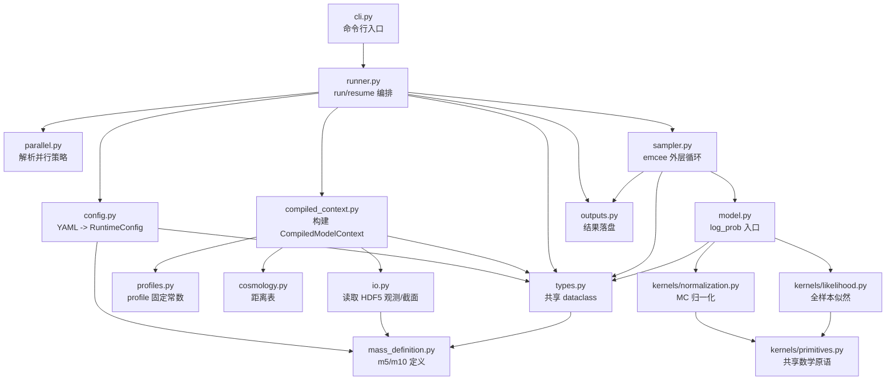
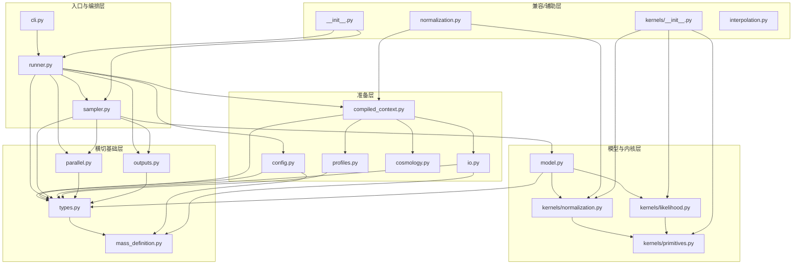

# Bayesian_inference 架构关系图谱

本文只覆盖 `Bayesian_inference` 子项目中与推断引擎直接相关的文件关系，目标是回答 3 个问题：

- 这个子项目的运行主链到底怎么走。
- `src/cmass_lens_inference` 里每个文件分别负责什么。
- 哪些文件属于真正的生产主路径，哪些只是兼容层、辅助层或测试支撑层。

## 项目概览

### 目录边界

- 主体分析对象：`src/cmass_lens_inference/**/*.py`
- 附录覆盖：`configs/*.yaml`、`sitecustomize.py`、`scripts/*.py`、`tests/*.py`
- 明确排除：`task_plan.md`、`progress.md`、`findings.md`、`.pytest_cache/`、`__pycache__/`

### 这套代码的核心分层

- 入口/编排层：`cli.py`、`runner.py`、`sampler.py`
- 配置/数据准备层：`config.py`、`profiles.py`、`io.py`、`cosmology.py`、`compiled_context.py`
- 数值模型层：`model.py`、`kernels/*`
- 横切基础层：`types.py`、`mass_definition.py`、`parallel.py`、`outputs.py`
- 兼容/辅助层：`normalization.py`、`interpolation.py`、`__init__.py`、`kernels/__init__.py`

### “主热路径”标记说明

- `是（数值热路径）`：每次 `log_prob` 评估都会进入，且直接参与数值计算。
- `是（主流程但非热点）`：运行链会经过，但主要做组织、初始化、IO 或调度。
- `否`：不在生产推断主链中，或者仅作为兼容/辅助入口存在。

## 主执行链

### 运行时顺序

1. `cli.py` 解析 `run` / `resume` 命令。
2. `runner.py` 调用 `config.py` 读取 YAML，并进入 `_build_runtime_context()`。
3. `_build_runtime_context()` 通过 `compiled_context.py` 一次性完成：
   - `profiles.py` 选择 `devauc` / `sersic` 固定常数和字段别名
   - `io.py` 读取 HDF5 观测、截面网格，以及可选的 FP sigma-unit table
   - `cosmology.py` 建距离表
   - `compiled_context.py` 把高层对象压平成 `numba` 友好的数组上下文，并在启用 FP prior 时附带 sigma-table 轴和 grid
4. `runner.py` 同时调用 `parallel.py` 解析线程/进程策略，并组装 `CompiledModel`。
5. `sampler.py` 启动 `emcee`，把每个 walker 的参数向量交给 `model.py:log_prob()`。
6. `model.py` 做 box prior 检查，然后依次调用：
   - `kernels/normalization.py` 估计 Monte Carlo 归一化；若启用 FP prior，则在同一轮 population MC 里额外累计 FP 回归 sufficient statistics
   - `kernels/likelihood.py` 计算全样本对数似然
   - `model.py` 在 Python 层对 FP sufficient statistics 做一次小型 OLS 解算，并把可选的 global FP prior 合并回 posterior
7. 两个 kernel 共同复用 `kernels/primitives.py` 中的底层数学原语。
8. `outputs.py` 负责把运行目录、checkpoint、metadata、run result 持久化到磁盘。

### 运行时调用链图

### 分层依赖图

## 核心文件关系矩阵

下面按层分组，但每个文件都用同一套字段描述。

### A. 包入口与运行调度层

#### `src/cmass_lens_inference/__init__.py`

- 作用：包级公共导出层，重新暴露 `run_inference`、`resume_inference`、`build_log_prob_fn`、`RunResult`。
- 直接依赖：`runner.py`、`sampler.py`、`types.py`
- 被谁依赖：当前仓库内没有内部模块继续依赖它，主要给外部调用者或交互式导入使用。
- 是否在主热路径：否
- 关键备注：它不是运行入口，只是 package surface；改它通常影响“怎么 import”，不影响推断逻辑。

#### `src/cmass_lens_inference/cli.py`

- 作用：命令行入口，只负责参数解析、选择 `run` 或 `resume`，然后把结果打印成 JSON。
- 直接依赖：`runner.py`
- 被谁依赖：无内部调用者；由 `pyproject.toml` 的 console script 和 `python -m cmass_lens_inference.cli` 触发。
- 是否在主热路径：是（主流程但非热点）
- 关键备注：它不做科学计算；任何数值逻辑出现在这里都属于分层污染。

#### `src/cmass_lens_inference/runner.py`

- 作用：整个推断流程的编排中枢，负责新建/恢复运行、构建 `RuntimeContext`、创建输出目录、调用 sampler。
- 直接依赖：`compiled_context.py`、`config.py`、`outputs.py`、`parallel.py`、`sampler.py`、`types.py`
- 被谁依赖：`cli.py`、`__init__.py`
- 是否在主热路径：是（主流程但非热点）
- 关键备注：这是“业务编排层”，不是数值层；`_build_runtime_context()` 是源码主链的重要连接点。

#### `src/cmass_lens_inference/sampler.py`

- 作用：封装 `emcee` 采样器、walker 初始化、process pool 初始化、checkpoint 节奏和阶段耗时汇总。
- 直接依赖：`model.py`、`outputs.py`、`parallel.py`、`types.py`
- 被谁依赖：`runner.py`、`__init__.py`
- 是否在主热路径：是（主流程但非热点）
- 关键备注：它位于“外层采样循环”，真正的数值密集计算不在这里，而在 `model.py` 和 `kernels/*`。

#### `src/cmass_lens_inference/outputs.py`

- 作用：管理运行目录、latest 指针、checkpoint、metadata、run result 和日志文件。
- 直接依赖：`types.py`
- 被谁依赖：`runner.py`、`sampler.py`
- 是否在主热路径：是（主流程但非热点）
- 关键备注：它只处理文件系统契约；推断能否恢复、产物是否可追踪，主要取决于这里的稳定性。

#### `src/cmass_lens_inference/parallel.py`

- 作用：把 YAML 中的并行配置解析成具体的线程/进程预算，并在运行时设置 OpenMP/BLAS/numba 线程上限。
- 直接依赖：`types.py`
- 被谁依赖：`runner.py`、`sampler.py`、`model.py`
- 是否在主热路径：是（主流程但非热点）
- 关键备注：它不做科学推断，但会直接改变性能表现和资源占用，是典型的横切运行时策略层。

### B. 配置、数据与上下文构建层

#### `src/cmass_lens_inference/config.py`

- 作用：把 YAML 配置解析成强类型 `RuntimeConfig`，并完成 `m5/m10` 公共参数名到内部固定 12 维向量的映射。
- 直接依赖：`mass_definition.py`、`types.py`
- 被谁依赖：`runner.py`
- 是否在主热路径：是（主流程但非热点）
- 关键备注：这是“配置归一化入口”；如果配置面和内部参数向量不一致，首先应该查这里。

#### `src/cmass_lens_inference/profiles.py`

- 作用：集中管理 `devauc` / `sersic` 两个分支唯一允许不同的固定常数、字段别名和结构先验参数。
- 直接依赖：`types.py`
- 被谁依赖：`compiled_context.py`
- 是否在主热路径：是（主流程但非热点）
- 关键备注：它把 profile 差异锁在单点，避免 profile 条件判断泄漏到 kernel 里。

#### `src/cmass_lens_inference/io.py`

- 作用：读取观测 HDF5、截面 HDF5 和可选的 FP sigma-unit table，并把不同 schema/别名归一化成稳定的 `ObservationRecord`、`CrossSectionGrid`、`SigmaUnitTable`。
- 直接依赖：`mass_definition.py`、`types.py`
- 被谁依赖：`compiled_context.py`
- 是否在主热路径：是（主流程但非热点）
- 关键备注：它承担新旧 HDF5 布局兼容，尤其是 `mass_definitions/<label>/` 新结构和 legacy `m5_*` 数据集之间的桥接；启用 FP prior 时，也由这里强校验 sigma-table 的 profile 与 `m5/m10` 质量定义是否匹配当前 run。

#### `src/cmass_lens_inference/cosmology.py`

- 作用：构建平直 Lambda-CDM 距离表，并提供 Einstein radius 的通用计算接口。
- 直接依赖：无内部依赖
- 被谁依赖：`compiled_context.py`
- 是否在主热路径：否（初始化期参与）
- 关键备注：生产热路径并不直接调用这里的方法，而是消费它预计算出来的 `z_table` 和 `chi` 表。

#### `src/cmass_lens_inference/compiled_context.py`

- 作用：把 profile、观测、截面、宇宙学、随机基底和可选 FP sigma-table 一次性压平成 `CompiledModelContext`，供 `numba` kernel 直接消费。
- 直接依赖：`cosmology.py`、`io.py`、`profiles.py`、`types.py`
- 被谁依赖：`runner.py`、`model.py`、`normalization.py`
- 是否在主热路径：是（主流程但非热点）
- 关键备注：这是 Python 对象世界和 `numba` 数组世界的转换层；热路径优化的关键前提就是把工作尽可能前移到这里。FP prior 的 sigma-table 轴、grid 和 prior 常数也在这一层完成编译期整理。

### C. 共享数据契约与物理定义层

#### `src/cmass_lens_inference/types.py`

- 作用：集中定义所有跨模块 dataclass，包括配置对象、观测记录、编译后上下文、运行结果与并行策略。
- 直接依赖：`mass_definition.py`
- 被谁依赖：几乎所有核心模块，尤其是 `config.py`、`compiled_context.py`、`runner.py`、`sampler.py`、`model.py`
- 是否在主热路径：否
- 关键备注：它是整个项目的数据契约中心；虽然不做数值计算，但几乎所有模块都围绕它对齐输入输出。

#### `src/cmass_lens_inference/mass_definition.py`

- 作用：封装 `m5` / `m10` 的物理定义、公共参数名、HDF5 子组名以及质量/速度弥散单位转换公式。
- 直接依赖：无内部依赖
- 被谁依赖：`config.py`、`io.py`、`types.py`、`normalization.py`
- 是否在主热路径：否
- 关键备注：这是“质量定义切换”能力的单一可信来源；凡是 `m5` 和 `m10` 之间的解析关系，都应该收敛到这里。

### D. 模型入口与数值内核层

#### `src/cmass_lens_inference/model.py`

- 作用：生产版 `log_prob` 入口；做 12/11/10 维参数检查、box prior 过滤、归一化计算、样本似然计算，并在启用时把 optional FP global prior 合并到 posterior，同时生成 HDF5-safe timing blob。
- 直接依赖：`compiled_context.py`、`kernels/likelihood.py`、`kernels/normalization.py`、`parallel.py`、`types.py`
- 被谁依赖：`sampler.py`
- 是否在主热路径：是（数值热路径）
- 关键备注：它是“采样器”和“内核”之间唯一的正式边界；如果要分析单次 `log_prob` 的行为，先从这里看。FP prior 的 OLS 解算也被刻意放在这里，而不是塞进 numba kernel。

#### `src/cmass_lens_inference/kernels/primitives.py`

- 作用：放置被多个 kernel 共享的底层 `numba` 原语，如 PDF/CDF、采样、距离表查值、`theta_ein_arcsec()`、`p_find()`、`mu_r()` 和 FP sigma-table 插值。
- 直接依赖：无内部依赖
- 被谁依赖：`kernels/likelihood.py`、`kernels/normalization.py`、`kernels/__init__.py`
- 是否在主热路径：是（数值热路径）
- 关键备注：它刻意与 dataclass、IO、YAML 脱钩，目的是让 kernel 层只依赖纯数组和纯标量数学。

#### `src/cmass_lens_inference/kernels/likelihood.py`

- 作用：单个 monolithic `numba` kernel，直接在数组上下文上计算整个样本的总 log-likelihood。
- 直接依赖：`kernels/primitives.py`
- 被谁依赖：`model.py`、`kernels/__init__.py`
- 是否在主热路径：是（数值热路径）
- 关键备注：这里不再按 lens 在 Python 层循环，而是一次性处理全样本；这是项目当前性能设计的关键。

#### `src/cmass_lens_inference/kernels/normalization.py`

- 作用：单个 monolithic `numba` kernel，使用固定随机基底做 Monte Carlo 归一化估计；启用 FP prior 时，额外在同一轮 parent-population MC 里累计 OLS sufficient statistics。
- 直接依赖：`kernels/primitives.py`
- 被谁依赖：`model.py`、`normalization.py`、`kernels/__init__.py`
- 是否在主热路径：是（数值热路径）
- 关键备注：它和 `likelihood.py` 共同组成生产版 `log_prob` 的两大数值核心。这里不直接做 FP 拟合，只输出最小充分统计量，把线性代数留给 Python 层的 `model.py`。

#### `src/cmass_lens_inference/kernels/__init__.py`

- 作用：`kernels` 子包的集中导出层。
- 直接依赖：`kernels/likelihood.py`、`kernels/normalization.py`、`kernels/primitives.py`
- 被谁依赖：当前主链没有强依赖它，主要服务于统一 import surface。
- 是否在主热路径：否
- 关键备注：它本身不包含逻辑；更多是包结构整理点。

### E. 兼容层与辅助层

#### `src/cmass_lens_inference/normalization.py`

- 作用：为旧测试和辅助路径提供归一化 wrapper，把生产 kernel 暴露成较友好的高层接口。
- 直接依赖：`compiled_context.py`、`kernels/normalization.py`、`mass_definition.py`、`types.py`
- 被谁依赖：当前生产主链不依赖它；主要被测试和辅助代码使用。
- 是否在主热路径：否
- 关键备注：这是明确的兼容层；真正的生产归一化路径已经转移到 `model.py -> kernels/normalization.py`。

#### `src/cmass_lens_inference/interpolation.py`

- 作用：提供一维线性插值并做边界 clip 的通用 helper。
- 直接依赖：无内部依赖
- 被谁依赖：当前 `src/` 主链中没有内部模块调用；主要被测试覆盖。
- 是否在主热路径：否
- 关键备注：它表达的是“项目级插值策略”，不是当前生产热路径的一部分；`numba` kernel 使用的是 `kernels/primitives.py` 里的内联版本。

## 附录：配置、脚本与测试文件

### 配置文件

#### `configs/devauc.yaml`

- 作用：给 `devauc` profile 提供完整运行配置。
- 与主流程关系：由 `config.py` 读取，最终驱动 `runner.py -> sampler.py -> model.py`。
- 关键差异：`profile.name=devauc`，观测文件指向 de Vaucouleurs 数据，初始参数名使用 `mu5_0/beta5/xi5/sigma5`。

#### `configs/sersic.yaml`

- 作用：给 `sersic` profile 提供完整运行配置。
- 与主流程关系：和 `devauc.yaml` 相同，都是生产入口配置。
- 关键差异：`profile.name=sersic`，观测文件不同，`profiles.py` 会因此启用 `uses_observed_n_in_likelihood=True` 的分支。

### 启动钩子

#### `sitecustomize.py`

- 作用：仓库根目录下的 Python 启动钩子。
- 与主流程关系：让 `python -m cmass_lens_inference.cli` 在未安装包时也能找到 `src/`，并提前设置 OpenMP 默认环境变量。
- 关键备注：它不决定线程预算，只做早期环境准备；真正的线程预算仍由 `parallel.py` 解析。

#### `scripts/sitecustomize.py`

- 作用：当用户以 `python scripts/foo.py` 方式从 `scripts/` 目录启动时，提供同样的 OpenMP 默认值。
- 与主流程关系：不进入推断主链，只是保证 `scripts/benchmark_log_prob.py` 这类脚本的启动环境干净。
- 关键备注：它比根目录版本更轻，只设置环境变量，不负责 `src/` 路径注入。

### 脚本

#### `scripts/benchmark_log_prob.py`

- 作用：对比当前实现与参考实现的 `log_prob` 性能，也可跑一个短的 smoke benchmark。
- 与主流程关系：直接调用 `config.py`、`model.py`、`parallel.py`、`runner.py`，因此是理解“生产实现如何被独立复用”的辅助入口。
- 关键备注：它不属于线上主链，但非常适合理解 `build_compiled_model()` 和 `log_prob()` 的外部使用方式。

### 测试基座

#### `tests/conftest.py`

- 作用：构造 synthetic HDF5、synthetic YAML，并把 `src/` 加入测试时的 `sys.path`。
- 与主流程关系：它不是生产逻辑，但几乎所有测试都依赖它提供的最小运行环境。
- 关键备注：如果测试里看到“单镜头小数据集”或临时配置，大多出自这里。

### 测试文件总览

#### `tests/test_math_core.py`

- 作用：验证基础数学和插值行为，如 `clipped_linear_interp`、宇宙学半径换算和归一化 guard。
- 与主流程关系：偏底层正确性，不覆盖整条 run 链。

#### `tests/test_config_profiles_io.py`

- 作用：验证配置解析、profile 选择、HDF5 alias 和 mass definition 兼容逻辑。
- 与主流程关系：主要对应 `config.py`、`profiles.py`、`io.py`、`mass_definition.py`。

#### `tests/test_mass_definition.py`

- 作用：锁定 `m5` / `m10` 抽象及精确转换关系。
- 与主流程关系：对应 `mass_definition.py`，保证公共参数名和物理变换不漂移。

#### `tests/test_parallel.py`

- 作用：验证自动并行策略解析和线程限制环境变量设置。
- 与主流程关系：对应 `parallel.py` 的运行时策略层。

#### `tests/test_outputs.py`

- 作用：验证运行目录结构、latest 指针和 checkpoint 文件契约。
- 与主流程关系：对应 `outputs.py` 的落盘契约。

#### `tests/test_compiled_model.py`

- 作用：验证 compiled context 是连续数组、mass definition 能进入上下文、`log_prob` 真正调用 monolithic `numba` kernels。
- 与主流程关系：是理解 `compiled_context.py + model.py + kernels/*` 的关键测试。

#### `tests/test_numba_hotspots.py`

- 作用：锁定生产热点确实在 `numba` kernel，而不是悄悄退化回 Python 循环。
- 与主流程关系：直接对应 `model.py`、`normalization.py` wrapper 和 `kernels/*`。

#### `tests/test_runner_cli.py`

- 作用：验证 `run_inference()`、`resume_inference()` 和 CLI 的最小端到端流程。
- 与主流程关系：这是最接近完整生产调用链的集成测试。

#### `tests/test_openmp_startup.py`

- 作用：验证两个 `sitecustomize.py` 是否在足够早的阶段设置 OpenMP 默认值。
- 与主流程关系：不验证科学逻辑，只验证启动环境是否安静、稳定。

## 一句话总结

如果只看最核心的生产链，可以把这个子项目理解成：

`cli/runner` 负责组织运行，`config + profiles + io + cosmology + compiled_context` 负责把高层输入预处理成数组，`sampler` 负责把参数向量不断送进 `model.log_prob()`，而 `model` 再把所有真正昂贵的工作下放给 `kernels/likelihood.py` 和 `kernels/normalization.py`；如果启用 FP prior，则 `normalization` 额外产出一组 FP sufficient statistics，`model` 用它们做一次小型 OLS 并把 global prior 加回 posterior；`types / mass_definition / parallel / outputs` 则是横切整个系统的基础设施层。
